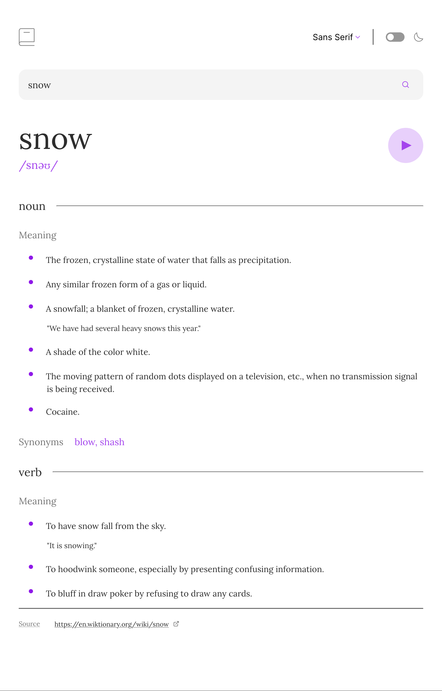
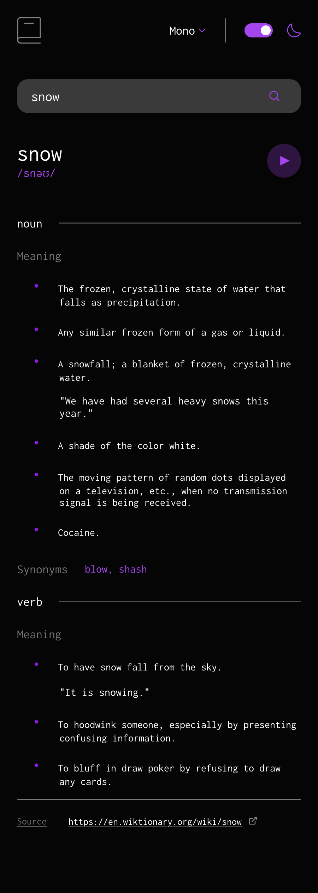
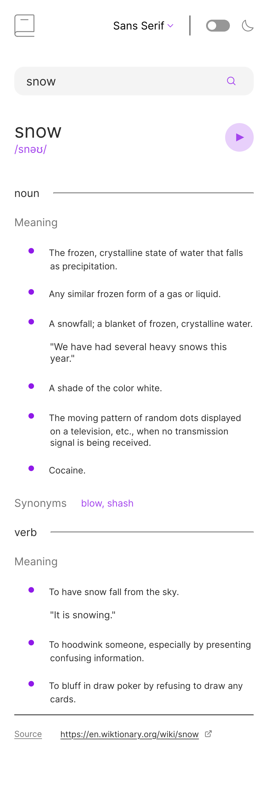

# Frontend Mentor - Dictionary web app solution

This is a solution to the [Dictionary web app challenge on Frontend Mentor](https://www.frontendmentor.io/challenges/dictionary-web-app-h5wwnyuKFL). Frontend Mentor challenges help you improve your coding skills by building realistic projects. 

## Table of contents

- [Overview](#overview)
  - [The challenge](#the-challenge)
  - [Screenshot](#screenshot)
  - [Links](#links)
- [My process](#my-process)
  - [Built with](#built-with)
- [Author](#author)

## Overview

### The challenge

Users should be able to:

- Search for words using the input field
- See the Free Dictionary API's response for the searched word
- See a form validation message when trying to submit a blank form
- Play the audio file for a word when it's available
- Switch between serif, sans serif, and monospace fonts
- Switch between light and dark themes
- View the optimal layout for the interface depending on their device's screen size
- See hover and focus states for all interactive elements on the page

### Screenshot

### Links

- Solution URL: [https://github.com/landot/dictionary-app](https://github.com/landot/dictionary-app)
- Live Site URL: [https://timothyl-portfolio-dictionary-app.netlify.app/](https://timothyl-portfolio-dictionary-app.netlify.app/)

## My process

### Built with

- HTML
- CSS
- React
- React-Router

## Author

- Portfolio Website - [https://timothyl-portfolio.netlify.app/](https://timothyl-portfolio.netlify.app/)
- github - [@landot](https://github.com/landot)
- Frontend Mentor - [@landot](https://www.frontendmentor.io/profile/landot)

